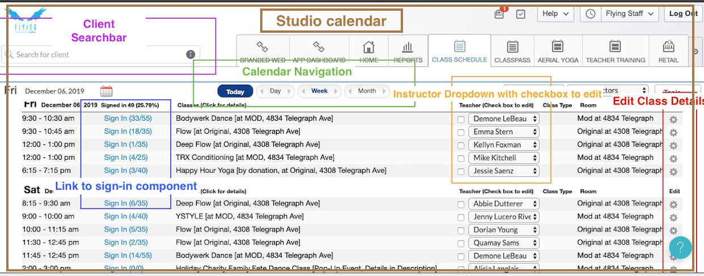
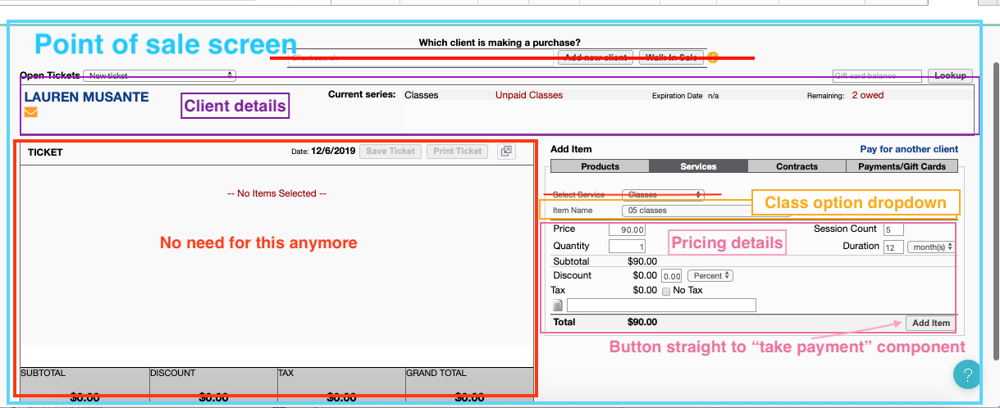
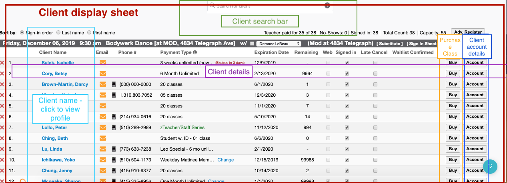

# _BrainFrame_

#### _Client management system to check in clients for fitness classes. Remake of currently-existing MindBody. December 2019_

#### By _**Lauren Musante**_

## Description

_Work in progress as of 12/22/19_

_This is the admin side of a client management system, where a user can see a table of currently-offered classes and sign in clients for each class. The user can look up clients that are already in the system, and can also add new clients. Users can navigate to a Class Calendar, a Client Display with a reactive Search Bar, and a Take Payment screen (the latter of which is not up and running as of 12/22/19._

The screen shots I took of MindBody, which are formed the base for what I built:_

## Setup/Installation Requirements

PAGE CONTENT IS NOT UP AND RUNNING YET 12/6/19

_Clone [this repository](https://github.com/LaurenMusante/BrainFrame) to your desktop. Navigate to the root directory in Terminal, then run "npm install" to install all packages and plug-ins needed. Once this step is complete, run "npm run start" in Terminal, and then alt-click on " http://localhost:8080/". Alternatively, you can copy " http://localhost:8080/" into your browser to view the page._

## Known Bugs

_None_

## Support and contact details

_Questions, comments, and feedback, please email: Lauren.Musante@gmail.com_

## Technologies Used

_JavaScript, React,_

### License

_Open source_

Copyright (c) 2019 **_Lauren Musante_**
