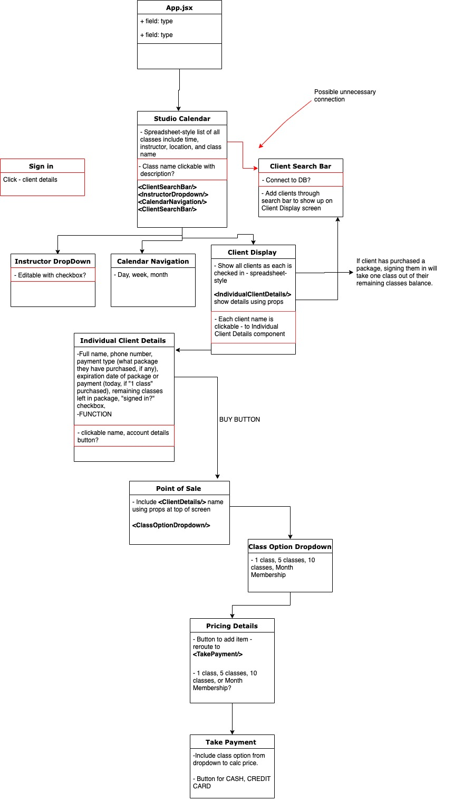

# _BrainFrame_

#### _Client Manager to check in clients for fitness classes. Remake of currently-existing MindBody. December 2019_

#### By _**Lauren Musante**_

## Description

_I started out by looking at MindBody's site and outlining what I thought my React components would be:_
  

  

  

_First draft wireframe for project:_

  
_red boxes indicate stretch goals at this point_

## Setup/Installation Requirements

PAGE CONTENT IS NOT UP AND RUNNING YET 12/6/19

_Clone [this repository](https://github.com/LaurenMusante/BrainFrame) to your desktop. Navigate to the root directory in Terminal, then run "npm install" to install all packages and plug-ins needed. Once this step is complete, run "npm run start" in Terminal, and then alt-click on " http://localhost:8083/". Alternatively, you can copy " http://localhost:8083/" into your browser to view the page._

## Known Bugs

_None_

## Support and contact details

_Questions, comments, and feedback, please email: Lauren.Musante@gmail.com_

## Technologies Used

_JavaScript, React,_

### License

*Open source*

Copyright (c) 2019 **_Lauren Musante_**